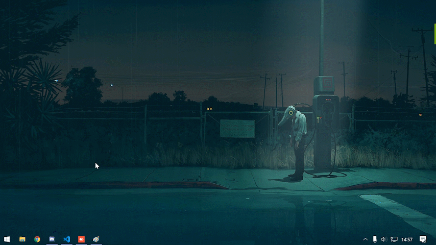

# CursorPong
The [DVD Screensaver](https://bouncingdvdlogo.com/) but using your mouse.  



## Running
Download this repository as a ZIP, extract it, Install [NodeJS](https://nodejs.org/en/), then run the `install packages.bat` and the `start.bat`

## Exiting
Assuming you've left the default exit combination, you can press `CTRL + ESC` to exit the application.

## Configuring
In this repository you will also find a `config.json` which you can customize to your liking.
```json
{
    "movementX": 1,    // controls the movement speed
    "movementY": 1,    // ^
    
    "endKey": {         // configure the key, which is used to exit the application
        "key": 1,       //which keycode? (https://keycode.info/)
        "ctrl": true,   // only when ctrl is held down?
        "alt": false,   // only when alt is held down?
        "shift": false  // only when shift is held down?
    }
}
```